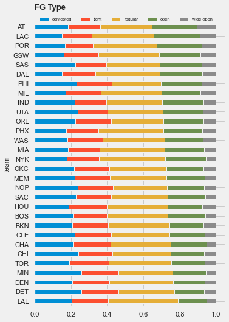

# NBA Shot Analysis

Based on the data of the 14-15 NBA regular season, this notebook explores a range of topics relating to offense and defense of teams and players, such as the most effective defensive players, teams' play style, the hot hand phenomenon, to name just a few.

## Data

The data is a detailed log of most of the shots attempted in the 14-15 season with details on who took the shot, the shot distance, the closest defender, etc. The dataset is available on [Kaggle](https://www.kaggle.com/dansbecker/nba-shot-logs).
